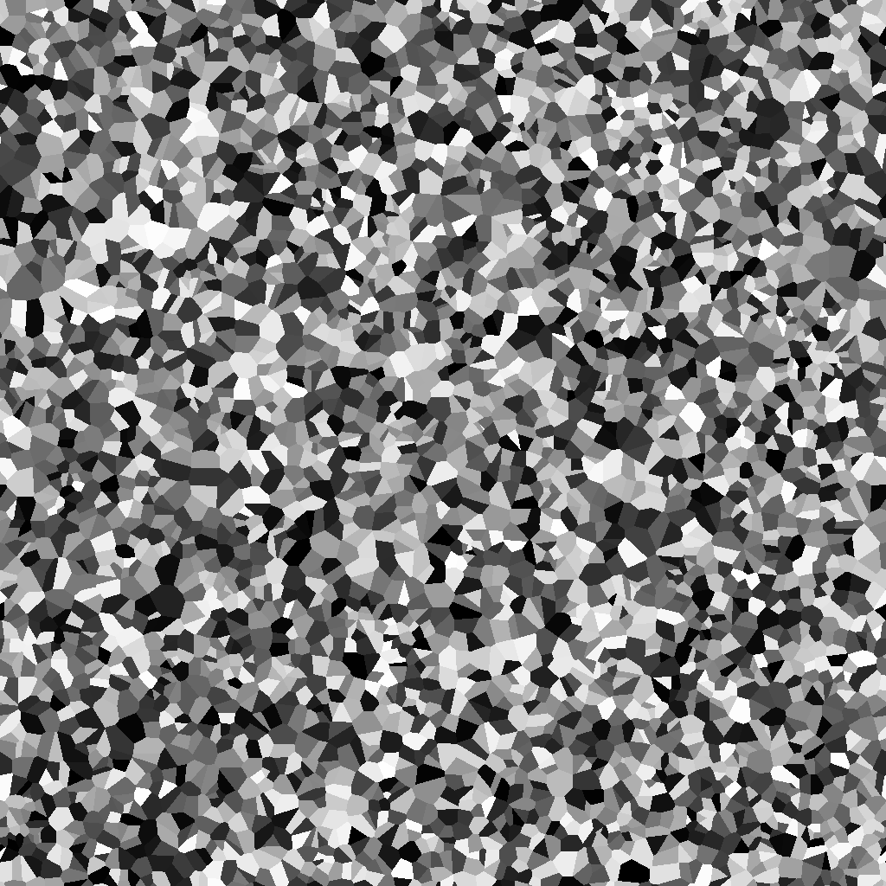

"# Primme_update" 

## 

## Usage

## Demo
### PRIMME trained with mode filter

  

### PRIMME trained with Monte Carlo Potts

### PRIMME trained with phase field

  

### inclination-dependent PRIMME

